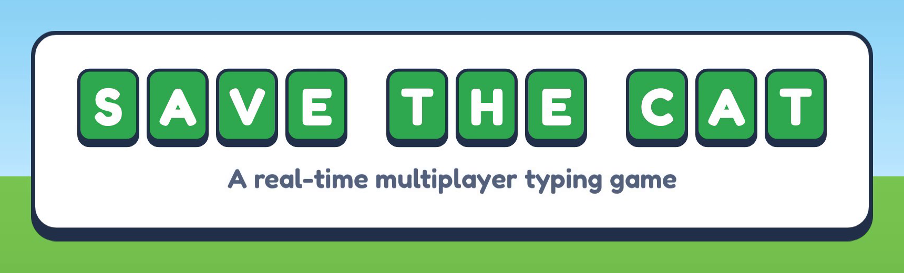
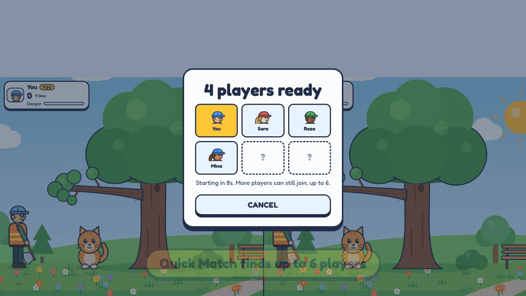

<div align="center">



**[English](README.md)** &nbsp;·&nbsp; **[▶ ویدیوی دمو (۴۵ ثانیه)](docs/demo.mp4)**



</div>

<div dir="rtl">

# Save the Cat — Online

یک مسابقه‌ی تایپ **۲ تا ۶ نفره**، هم روی شبکه‌ی محلی (وای‌فای یا هات‌اسپات) و هم روی اینترنت. همه یک کلمه‌ی یکسان می‌گیرند؛ هر کس به موقع تمام کند شاخه‌اش را می‌بُرد، و آخرین گربه‌ای که سالم بماند برنده است.

## سه راه بازی

- **QUICK MATCH:** بازیکن به یک اتاق در حال تشکیل می‌پیوندد. وقتی دو نفر جمع شوند، شمارش معکوس ۱۰ ثانیه‌ای شروع می‌شود تا نفرات بیشتری (تا ۶ نفر) بیایند. اگر اتاق ۶ نفره پر شود، بازی همان لحظه شروع می‌شود.
- **CREATE ROOM / JOIN ROOM:** یک کد چهار حرفی ساخته می‌شود و برای دوستانتان می‌فرستید (تا ۶ نفر). میزبان هر وقت دست‌کم ۲ نفر جمع شدند START MATCH را می‌زند.
- **PLAY SOLO:** نسخه‌ی تک‌نفره که بدون سرور و بدون حریف کار می‌کند.

## پیش‌نیاز

**Node.js نسخه‌ی 22.13 یا بالاتر** (از nodejs.org). هیچ پکیجی لازم نیست و `npm install` نمی‌خواهد؛ دیتابیس SQLite داخل خود Node.js است.

چون همه‌ی بازیکن‌ها باید حساب داشته باشند، سرور بدون دیتابیس اجرا نمی‌شود. روی نسخه‌های قدیمی‌تر Node.js پیغامی چاپ می‌کند که باید Node.js را به‌روز کنید.

## اجرا

۱. پوشه‌ی بازی را روی یک لپ‌تاپ یا کامپیوتر باز کنید و در ترمینال بزنید:

```
node server.js
```

۲. سرور دو آدرس نشان می‌دهد:

```
On this computer:   http://localhost:3000
On your network:    http://192.168.1.5:3000
```

۳. روی همان کامپیوتر آدرس اول را در مرورگر باز کنید و **CREATE ROOM** را بزنید. یک کد چهار حرفی نمایش داده می‌شود.

۴. دستگاه دوم (گوشی، تبلت یا لپ‌تاپ دیگر) باید به **همان وای‌فای یا هات‌اسپات** وصل باشد. آدرس دوم (`http://192.168...`) را باز کنید، **JOIN ROOM** را بزنید و کد را وارد کنید.

۵. میزبان **START MATCH** را می‌زند.

برای عوض کردن پورت:

```
PORT=8080 node server.js          (مک و لینوکس)
set PORT=8080 && node server.js   (ویندوز)
```

## قوانین

- همه‌ی بازیکن‌ها هم‌زمان یک کلمه‌ی یکسان می‌گیرند.
- هر کس کلمه را **به موقع** کامل کند، کارگرش شاخه را می‌بُرد و در امان است. امتیاز بر اساس سرعت و رتبه است: نفر اول امتیاز کامل، نفر دوم ۷۰٪، سوم ۵۰٪، و به همین ترتیب. نفر اول کمی هم از خطر شاخه‌اش کم می‌شود.
- هر کس به موقع تمام نکند، شاخه‌اش ۲۵٪ پایین می‌آید. هر کلید اشتباه ۳٪.
- اگر همه تمام کنند، کندترین نفر هم جریمه می‌شود: ۲۰٪ در دوئل دو نفره و ۱۰٪ در گروه. این‌طوری فشار رقابت همیشه هست.
- کسی که «Danger»ـش به ۱۰۰٪ برسد، **حذف** می‌شود (گربه فقط می‌ترسد و آسیبی نمی‌بیند). او می‌تواند بقیه‌ی مسابقه را تماشا کند یا با LEAVE MATCH خارج شود.
- آخرین کسی که حذف نشده باشد برنده است. اگر چند نفر تا آخر مرحله‌ی ۱۰ دوام بیاورند، امتیاز بالاتر برنده است.
- جدول پایانی رتبه‌ی همه را نشان می‌دهد: اول کسانی که تا آخر ماندند (به ترتیب امتیاز)، بعد حذف‌شده‌ها (هر کس دیرتر حذف شده، رتبه‌ی بهتری دارد).

**نمایش:** در دوئل دو نفره هر دو پارک کنار هم نمایش داده می‌شوند. در گروه ۳ تا ۶ نفره، پارک خود بازیکن بزرگ است و رقبا در کارت‌های سبک نشان داده می‌شوند: شاخه، گربه، امتیاز، نوار خطر، پیشرفت تایپ و پینگ. کارت‌ها اندازه‌شان را با صفحه تنظیم می‌کنند تا روی گوشی هم همه دیده شوند.

امتیازدهی و مقدار خطر در شیء `GAME` در بالای `server.js` قابل تنظیم هستند. زمان و سختی مراحل در `public/wordbank.js` است.

## کلمات

بازی حدود **۳۰۰۰ کلمه‌ی رایج انگلیسی** و ۶۷ عبارت با موضوع پارک و گربه دارد. کلمه‌ها در ۱۰ سطح دسته‌بندی شده‌اند و در یک مسابقه هیچ کلمه‌ای تکرار نمی‌شود. همه‌ی کلمات داخل خود پروژه‌اند (`public/words.js`)، پس بازی به هیچ سرویس بیرونی وابسته نیست و بدون اینترنت هم کار می‌کند.

**از کجا آمده‌اند:** از فهرست فراوانی کلمات انگلیسی (wordfreq) انتخاب شده‌اند، با این فیلترها:
- فقط کلماتی که در فرهنگ لغت هستند.
- اسم آدم‌ها، شهرها، برندها و مخفف‌ها حذف شده‌اند.
- کلمات نامناسب برای یک بازی خانوادگی حذف شده‌اند: فحش، خشونت، مسائل بزرگسالان، مواد، سیاست و مذهب.

**سختی هر کلمه:** بر اساس طول، میزان رایج بودن (کلمه‌ی نادرتر سخت‌تر است)، حروف سخت مثل Q، Z، X و J، و حروف تکراری پشت سر هم.

**مراحل:** هر مرحله از دو سطح نزدیک به هم کلمه می‌گیرد. از مرحله‌ی ۷ عبارت‌های چندکلمه‌ای هم اضافه می‌شوند. زمان هر کلمه به طولش بستگی دارد. سرعت تایپ لازم تقریباً این‌طور بالا می‌رود:

| مرحله | ۱ | ۳ | ۵ | ۷ | ۸ | ۹ | ۱۰ |
|---|---|---|---|---|---|---|---|
| میانگین طول | ۳ | ۴ | ۵–۶ | ۷–۸ | ۹ | ۱۱ | ۱۳ |
| سرعت لازم (کلمه در دقیقه) | ۵ | ۸ | ۱۲ | ۱۸ | ۲۲ | ۲۷ | ۳۴ |

تنظیم سختی (زمان پایه، زمان اضافه برای هر حرف، سطح‌ها و احتمال عبارت در هر مرحله) در `LEVELS` داخل `public/wordbank.js` است. هم حالت چندنفره و هم تک‌نفره از همین فایل استفاده می‌کنند.

**کلمات خودتان:** فایل `custom-words.txt` را باز کنید و در هر خط یک کلمه یا عبارت بنویسید (فقط حروف انگلیسی و فاصله، ۲ تا ۲۴ حرف). سطح هر کلمه خودکار تعیین می‌شود. عبارت‌هایی که فاصله دارند از مرحله‌ی ۷ به بعد می‌آیند.

- به‌طور پیش‌فرض کلمات شما با فهرست اصلی **ترکیب** می‌شوند.
- برای بازی **فقط با کلمات خودتان** (مثلاً لغات درس این هفته):
  ```
  WORDS_MODE=only node server.js
  ```
- فایل را می‌توانید وقتی سرور روشن است ویرایش کنید؛ مسابقه‌های بعدی کلمات جدید را استفاده می‌کنند و سرور پیام `Words reloaded` چاپ می‌کند.
- حالت تک‌نفره هم وقتی از طریق سرور باز شود، کلمات شما را استفاده می‌کند.

**ساختن دوباره‌ی فهرست اصلی (اختیاری):** اگر می‌خواهید تعداد یا فیلترها را عوض کنید:
```
pip install wordfreq english-words better_profanity
python3 tools/build-words.py
```

## حساب کاربری، آواتار و لیدربورد

**ثبت‌نام اجباری است.** اولین صفحه‌ی بازی صفحه‌ی ورود و ثبت‌نام است. تا کسی وارد حساب نشود، نه منو را می‌بیند، نه می‌تواند Quick Match، اتاق خصوصی یا حالت تک‌نفره بازی کند. این محدودیت روی خود سرور هم اعمال می‌شود، نه فقط با مخفی کردن دکمه‌ها؛ حتی یک برنامه‌ی دست‌ساز هم بدون حساب نمی‌تواند وارد بازی شود.

- **ثبت‌نام:** نام کاربری ۳ تا ۱۶ حرف (فارسی هم مجاز است)، رمز حداقل ۶ کاراکتر. دکمه‌ی SHOW رمز را نمایش می‌دهد.
- **آواتار:** بعد از ثبت‌نام صفحه‌ی پروفایل باز می‌شود تا ظاهر کارگر را انتخاب کنید: مرد یا زن، ۵ رنگ پوست، ۶ رنگ کلاه ایمنی و ۶ رنگ مو. تغییرات خودکار ذخیره می‌شوند. آواتار همه‌جا دیده می‌شود: کارگر داخل پارک، کارت رقبا، لابی، صفحه‌ی جستجوی حریف، جدول نتایج و لیدربورد.
- **پروفایل (دکمه‌ی PROFILE در منو):** ویرایش آواتار، آمار (امتیاز، بهترین امتیاز، رتبه، تعداد مسابقه، مقام اول، بهترین امتیاز تک‌نفره)، ۵ مسابقه‌ی اخیر با تغییر امتیاز، تغییر رمز و خروج از حساب.
- **تغییر رمز:** رمز فعلی لازم است. بعد از تغییر، حساب روی بقیه‌ی دستگاه‌ها خودکار خارج می‌شود.

**امتیاز رتبه‌بندی (Elo):** همه با ۱۰۰۰ شروع می‌کنند. در مسابقه‌ی گروهی، هر بازیکن با تک‌تک بقیه مقایسه می‌شود: از هر کس بالاتر تمام کرده امتیاز می‌گیرد و به هر کس پایین‌تر تمام کرده امتیاز می‌دهد. بردن از بازیکن قوی‌تر امتیاز بیشتری دارد. تغییر کل طوری تقسیم شده که یک مسابقه‌ی ۶ نفره تقریباً به اندازه‌ی یک دوئل روی امتیاز اثر بگذارد. در لیدربورد، «first» یعنی تعداد مسابقه‌هایی که بازیکن نفر اول شده است.

**مسابقه‌ی رتبه‌ای:** چون همه حساب دارند، همه‌ی مسابقه‌ها رتبه‌ای‌اند (مگر اینکه یک حساب از دو تب وارد یک مسابقه شده باشد). در این صورت مسابقه رتبه‌ای است و در امتیاز، برد و باخت حساب می‌شود. مسابقه با مهمان در تاریخچه ذخیره می‌شود ولی روی پروفایل و لیدربورد اثری ندارد، تا کسی نتواند با بردن از تب مهمان خودش برد جمع کند. کنار اسم هر بازیکن در بازی، امتیازش یا برچسب GUEST نمایش داده می‌شود.

**لیدربورد:** دو بخش دارد: **DUEL RATING** بر اساس امتیاز دوئل، و **SOLO BEST** بر اساس بهترین امتیاز تک‌نفره. رتبه‌ی خود بازیکن هم پایین لیست نمایش داده می‌شود. حالت تک‌نفره هم امتیاز بازیکنِ واردشده را خودکار ثبت می‌کند.

**امنیت:**
- رمزها با scrypt و salt جداگانه هش می‌شوند و خود رمز هیچ‌جا ذخیره نمی‌شود.
- نشست ورود ۳۰ روز اعتبار دارد و در دیتابیس فقط هش آن نگه داشته می‌شود.
- تعداد تلاش ورود (۱۰ بار در ۱۰ دقیقه) و ساخت حساب (۵ حساب در ساعت از یک شبکه) محدود است.
- نتیجه‌ی دوئل را سرور تعیین می‌کند و قابل دستکاری نیست. امتیاز تک‌نفره را مرورگر می‌فرستد؛ سرور امتیازهای غیرممکن را رد می‌کند، ولی جلوی تقلب ماهرانه در حالت تک‌نفره را کامل نمی‌گیرد.
- روی اینترنت حتماً از HTTPS استفاده کنید تا رمزها رمزگذاری‌شده ارسال شوند. هاست‌هایی مثل Render و Railway این را خودکار فراهم می‌کنند.

**محل ذخیره:** فایل `data/savethecat.db`. برای تغییر مسیر، متغیر `DB_PATH` را تنظیم کنید. برای پشتیبان‌گیری، سرور را متوقف کنید و فایل را کپی کنید. برای صفر کردن لیدربورد، فایل را حذف کنید.

**جدول‌های دیتابیس:** `users` (حساب و آمار)، `sessions` (ورودها)، `matches` و `match_players` (تاریخچه‌ی همه‌ی مسابقه‌ها با رتبه، امتیاز و تغییر امتیاز هر بازیکن)، `solo_runs` (همه‌ی بازی‌های تک‌نفره). ساختار با شماره‌ی نسخه مدیریت می‌شود تا در به‌روزرسانی‌های بعدی داده‌ها از بین نروند.

## ناوبری و خروج از بازی

- **هر صفحه دکمه‌ی برگشت دارد:** BACK، CANCEL یا MAIN MENU، بسته به صفحه. کلید **Esc** هم همان کار را می‌کند.
- **خروج وسط بازی:** دکمه‌ی خروج کنار دکمه‌ی صدا، یا کلید Esc، یک پیغام تأیید نشان می‌دهد:
  - در مسابقه‌ی آنلاین بازی برای بقیه ادامه دارد؛ اگر خارج شوید حذف حساب می‌شوید و برای امتیاز رتبه‌ای یک باخت ثبت می‌شود.
  - در حالت تک‌نفره بازی تا تصمیم شما **متوقف** می‌ماند و تایمر جلو نمی‌رود.
- بازیکنی که از مسابقه خارج شده، دیگر پیام‌های آن مسابقه را دریافت نمی‌کند و مستقیم به منو برمی‌گردد.

## هم‌زمانی و سرعت (شبکه)

- **ارسال دسته‌ای:** پیشرفت تایپ همه‌ی بازیکن‌ها ۱۰ بار در ثانیه، آن هم فقط وقتی چیزی تغییر کرده، در یک پیام کوچک برای همه فرستاده می‌شود. در تست ۶ نفره این حدود ۲ پیام در ثانیه برای هر بازیکن بود، پس اینترنت ضعیف هم مشکلی ندارد.
- **جبران تأخیر:** سرور هر ۲ ثانیه پینگ هر بازیکن را اندازه می‌گیرد. بازیکنی که اینترنت کندتری دارد، کلمه را دیرتر می‌بیند و نتیجه‌اش هم دیرتر به سرور می‌رسد؛ برای همین زمان تمام کردنش به اندازه‌ی یک رفت‌وبرگشت کامل جبران می‌شود. سقف جبران ۱۵۰ میلی‌ثانیه است تا کسی با جعل تأخیر سود نبرد. این عدد با `MAX_COMP_MS` در `server.js` قابل تغییر است.
- **ترتیب نهایی:** ترتیب نفرات بعد از تمام شدن دور و با زمان‌های جبران‌شده تعیین می‌شود، نه به ترتیب رسیدن پیام‌ها.
- **تایمر هم‌زمان:** تایمر هر بازیکن با توجه به پینگ خودش تنظیم می‌شود تا همه تقریباً هم‌زمان صفر شوند.
- **نشانگر پینگ:** کنار اسم هر بازیکن پینگش با رنگ نمایش داده می‌شود: سبز زیر ۹۰ میلی‌ثانیه، زرد تا ۲۲۰، قرمز بالاتر.

## قطع و وصل شدن اینترنت

اگر اینترنت یک بازیکن قطع شود، صفحه را رفرش کند یا چند لحظه از مرورگر بیرون برود، **۱۵ ثانیه** فرصت دارد برگردد:

- مسابقه برای همه متوقف می‌شود و بقیه یک شمارش معکوس می‌بینند (اگر بازیکن قبلاً حذف شده باشد، مسابقه متوقف نمی‌شود).
- بازیکن خودکار به همان جایگاه برمی‌گردد و دوری که نیمه‌کاره مانده بود با یک کلمه‌ی تازه دوباره شروع می‌شود. امتیاز و خطر شاخه‌ها سر جایشان می‌مانند.
- اگر ۱۵ ثانیه تمام شود، آن بازیکن حذف می‌شود (در جدول با برچسب left) و مسابقه برای بقیه ادامه پیدا می‌کند. اگر فقط یک نفر بماند، او برنده است.
- بعد از مسابقه: در Quick Match دکمه‌ی **FIND NEW MATCH** و در اتاق خصوصی دکمه‌ی **BACK TO ROOM** برای مسابقه‌ی بعدی با همان گروه.

مدت این فرصت در `server.js` با `GRACE_MS` قابل تغییر است.

## حالت تک‌نفره

دکمه‌ی **PLAY SOLO** در منو نسخه‌ی تک‌نفره را باز می‌کند (پوشه‌ی `public/solo`). این حالت هم ورود به حساب می‌خواهد: از همان حساب صفحه‌ی اصلی استفاده می‌کند، آواتار شما را روی کارگر نشان می‌دهد و بهترین امتیازتان را در لیدربورد ثبت می‌کند. چون حساب لازم است، باید از طریق سرور باز شود؛ اگر فایل را مستقیم باز کنید، پیغام راهنما نمایش داده می‌شود.

## ساختار فایل‌ها

```
server.js            سرور Node.js: فایل‌ها + API حساب و لیدربورد + اتاق‌ها + منطق مسابقه (WebSocket در /ws)
db.js                دیتابیس SQLite: حساب‌ها، آواتار، نشست‌ها، تاریخچه، رتبه‌بندی Elo، لیدربورد
public/avatar.js     رنگ‌ها و ساخت آواتار (مشترک بین صفحه‌ها و سرور)
custom-words.txt     کلمات دلخواه شما (اختیاری)
public/words.js      فهرست حدود ۳۰۰۰ کلمه‌ی درجه‌بندی‌شده
public/wordbank.js   تنظیم سختی مراحل و انتخاب کلمات (مشترک بین سرور و حالت تک‌نفره)
tools/build-words.py اسکریپت ساخت فهرست کلمات
data/                فایل دیتابیس (خودکار ساخته می‌شود)
package.json         فقط برای npm start
public/index.html    صفحه‌ی بازی دو نفره
public/style.css     استایل‌ها
public/script.js     نمایش دو پارک، ارتباط با سرور، تایپ
public/solo/         نسخه‌ی تک‌نفره
```

سرور تصمیم‌گیرنده است: کلمه‌ها را انتخاب می‌کند، زمان را نگه می‌دارد و برنده‌ی هر دور را تعیین می‌کند، پس دستکاری مرورگر یک بازیکن نتیجه را عوض نمی‌کند.

## اگر دستگاه دوم وصل نشد

- مطمئن شوید هر دو دستگاه روی یک شبکه هستند. بعضی وای‌فای‌های عمومی یا مهمان، دستگاه‌ها را از هم جدا می‌کنند؛ هات‌اسپات گوشی معمولاً بهتر جواب می‌دهد.
- **ویندوز:** بار اول که `node server.js` را اجرا می‌کنید، پنجره‌ی فایروال می‌پرسد اجازه‌ی دسترسی بدهد یا نه. گزینه‌ی **Private networks** را تیک بزنید.
- **مک:** اگر پیام «accept incoming network connections» آمد، Allow را بزنید.
- آدرس را با `http://` وارد کنید، نه `https://`.

## امنیت هنگام اجرا

**چه چیزی در دسترس بقیه است:** سرور فقط فایل‌های داخل پوشه‌ی `public/` را نشان می‌دهد. `server.js`، `db.js`، پوشه‌ی `data/` (دیتابیس)، فایل‌های مخفی مثل `.env` و هر فایل دیگری روی کامپیوتر شما قابل دسترسی نیستند. این موارد با درخواست‌های مخرب مختلف تست شده‌اند.

**چه کسی می‌تواند وصل شود:** وقتی `node server.js` را اجرا می‌کنید، هر دستگاهی که روی **همان شبکه** باشد می‌تواند بازی را باز کند. از اینترنت قابل دسترسی نیست، مگر اینکه روی مودم port forwarding تنظیم کرده باشید یا آن را روی هاست بگذارید. برای اینکه فقط روی همین کامپیوتر در دسترس باشد:

```
HOST=127.0.0.1 node server.js
```

**محافظت‌های داخلی:**
- درخواست‌های خراب یا مخرب سرور را از کار نمی‌اندازند.
- هر آدرس IP حداکثر ۱۲ اتصال هم‌زمان دارد (`MAX_CONNS_PER_IP` در `server.js`).
- تلاش‌های ورود و ثبت‌نام محدود است.
- کوئری‌های دیتابیس parameterized هستند (در برابر SQL injection).
- هدرهای امنیتی مرورگر فعال است.

**نکته‌ها:**
- روی شبکه‌ی محلی ارتباط با `http` است، نه `https`. کسی که روی همان وای‌فای ترافیک را شنود کند، می‌تواند رمز عبور را ببیند. روی شبکه‌ی عمومی رمز مهمی استفاده نکنید، و روی هاست حتماً HTTPS داشته باشید.
- سرور را با کاربر معمولی اجرا کنید، نه با `sudo` یا root.
- وقتی بازی نمی‌کنید، سرور را با Ctrl+C ببندید.
- آدرس‌هایی مثل `172.17.x.x` تا `172.19.x.x` معمولاً مربوط به Docker روی خود کامپیوتر هستند و دستگاه‌های دیگر از آن‌ها استفاده نمی‌کنند.

## بردن روی اینترنت (هاست)

به هاستی نیاز دارید که **Node.js** و **WebSocket** را اجرا کند، مثل Render، Railway، Fly.io یا یک VPS. هاست‌های اشتراکی معمولی (cPanel با PHP)، GitHub Pages و Netlify فقط فایل نشان می‌دهند. روی آن‌ها حالت تک‌نفره کار می‌کند، اما دوئل نه.

نمونه با Render:

1. پوشه‌ی بازی را در یک مخزن GitHub بگذارید.
2. در Render یک **Web Service** جدید بسازید و مخزن را انتخاب کنید.
3. Build Command را خالی بگذارید و Start Command را `node server.js` تنظیم کنید.
4. در قسمت Health Check Path مقدار `/health` را وارد کنید.

**مهم برای دیتابیس:** دیسک بیشتر هاست‌ها موقتی است و با هر ری‌استارت یا آپلود نسخه‌ی جدید پاک می‌شود. در این صورت همه‌ی حساب‌ها و لیدربورد از بین می‌روند. باید یک **دیسک دائمی** بسازید و `DB_PATH` را روی آن تنظیم کنید:

- **Render:** در تنظیمات سرویس یک Disk اضافه کنید (مثلاً mount path برابر `/var/data`) و `DB_PATH=/var/data/savethecat.db` بگذارید. نسخه‌ی رایگان Render دیسک دائمی ندارد.
- **Railway:** یک Volume به سرویس وصل کنید (مثلاً `/data`) و `DB_PATH=/data/savethecat.db` بگذارید.
- **Fly.io:** با `fly volumes create` یک volume بسازید و در `fly.toml` آن را mount کنید.
- **VPS:** نیازی به کار خاصی نیست؛ پوشه‌ی `data` روی دیسک سرور می‌ماند.

پورت را خود هاست از طریق متغیر `PORT` می‌دهد و سرور همان را می‌خواند. روی HTTPS هم کلاینت خودش از `wss://` استفاده می‌کند. صفحه‌ی اتاق روی اینترنت به‌جای متن وای‌فای، آدرس سایت را نشان می‌دهد تا برای دوستتان بفرستید.

چند نکته برای سایت عمومی:
- نسخه‌ی رایگان Render بعد از ۱۵ دقیقه بی‌کاری می‌خوابد و اولین باز شدن ممکن است نیم دقیقه طول بکشد.
- اتاق‌ها در حافظه‌ی سرور نگه داشته می‌شوند. اگر سرور ری‌استارت شود، مسابقه‌های در جریان تمام می‌شوند.
- این سرور برای یک پروسه‌ی تکی طراحی شده است. اگر هاست چند نمونه اجرا کند، دو بازیکن ممکن است به دو نمونه‌ی جدا وصل شوند و همدیگر را پیدا نکنند. تعداد نمونه‌ها (instances) را روی ۱ بگذارید.
- یک محدودیت ساده جلوی ارسال پیام‌های بیش از حد را می‌گیرد، ولی سیستم حساب کاربری یا فیلتر اسم ندارد.


</div>
