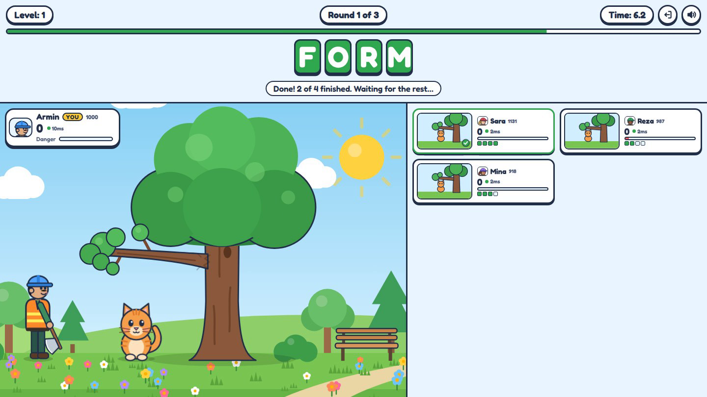
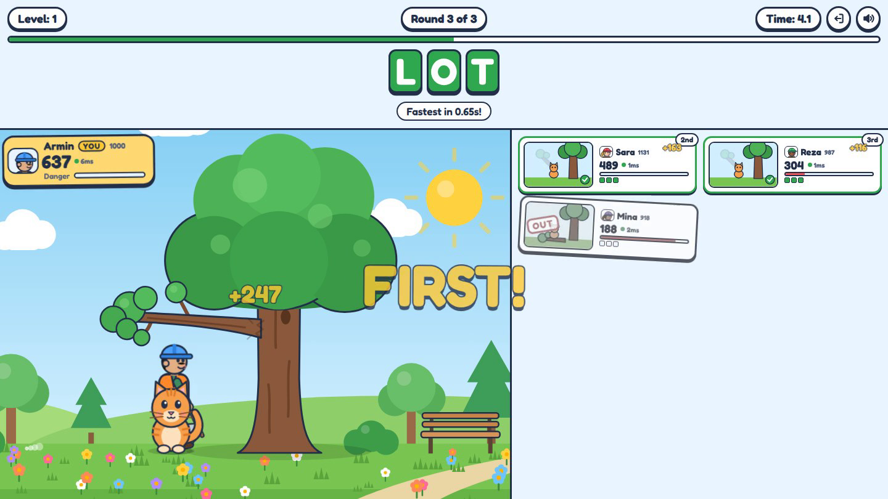
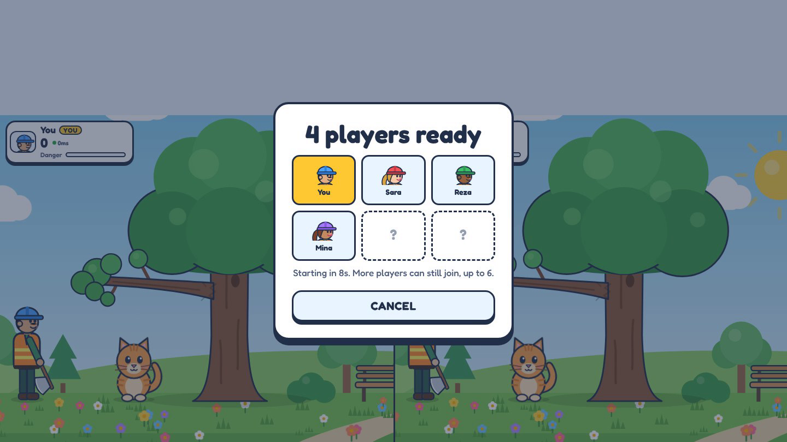
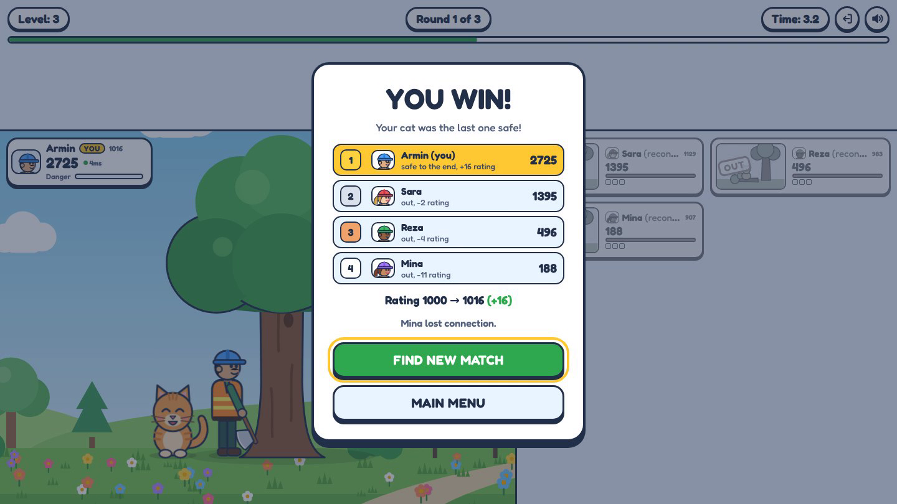
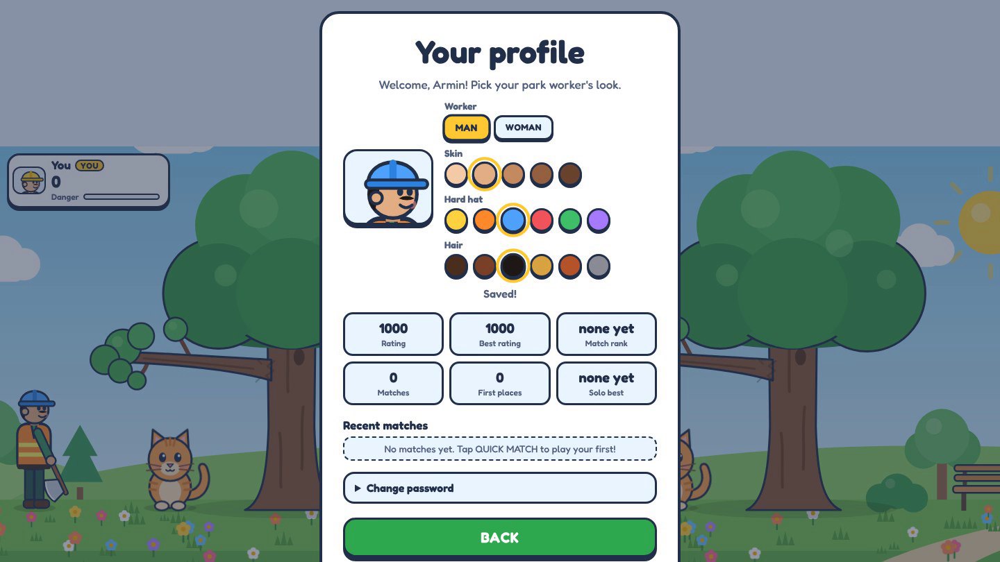
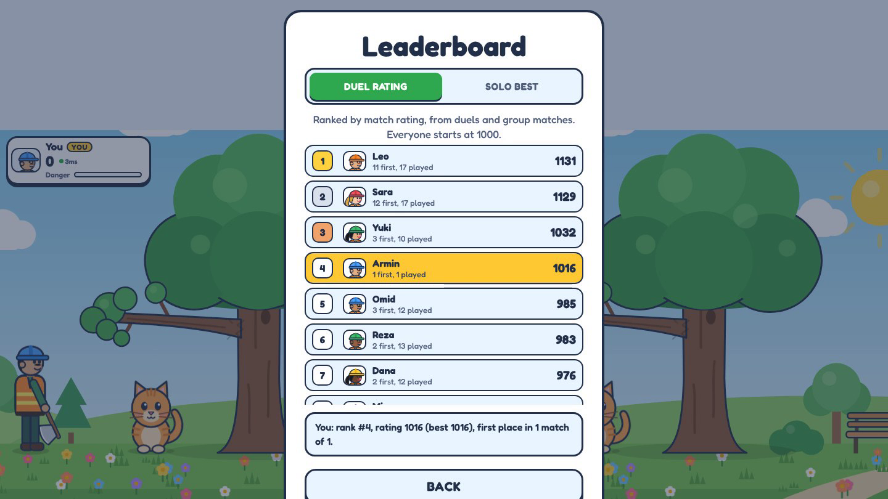
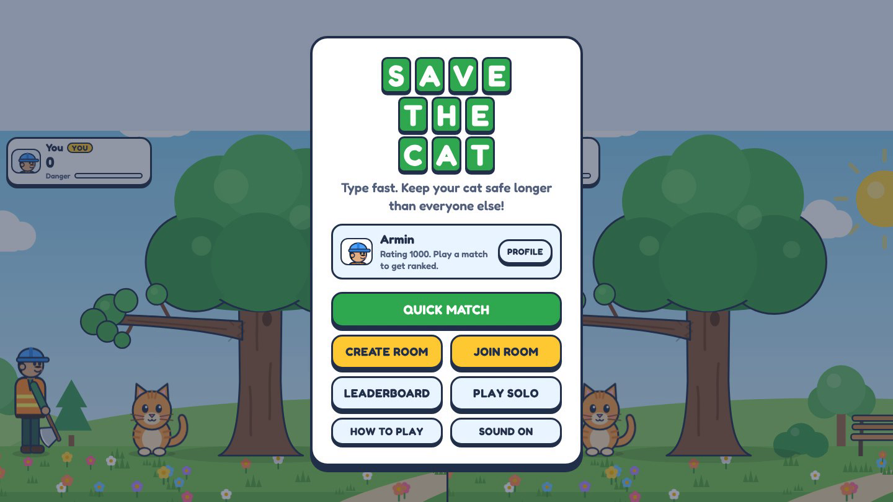
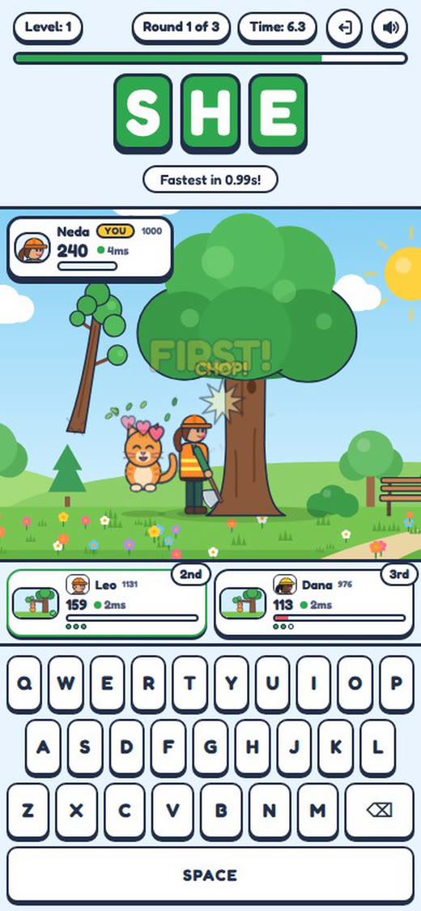
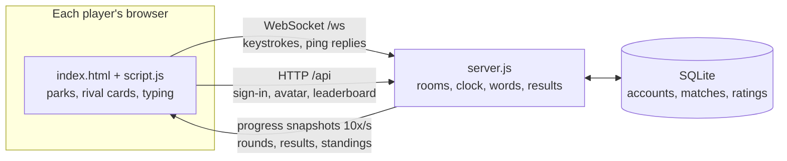

<div align="center">


**Race up to five other players to type the same word.**<br>
Finish it in time and your park worker cuts the branch before it lands on your cat. Last cat standing wins.

<p>
  
  
  
  
</p>

**[▶ Watch the 45-second demo](docs/demo.mp4)** &nbsp;·&nbsp; [Square version](docs/demo-square.mp4) &nbsp;·&nbsp; [فارسی](README.fa.md)


</div>

<!-- Tip: to show a video player here instead of the GIF, edit this file on GitHub and drag docs/demo.mp4 into the editor. -->

---

## Features

- **Real-time multiplayer for 2 to 6 players.** Quick Match pairs you with whoever is waiting, or create a private room and share its 4-letter code.
- **Fair on any connection.** The server measures each player's ping and credits back the network delay, so a slower connection doesn't lose a race it actually won.
- **Accounts, avatars and Elo ratings.** Pick your park worker's look (character, skin, hard hat and hair), climb the global leaderboard, and see your match history.
- **About 3,000 graded words** across 10 levels, plus phrases from level 7. No word repeats within a match, and you can add your own word list.
- **Drops and reloads are handled.** A player who loses their connection has 15 seconds to come back; the match pauses and picks up where it left off.
- **Works on phones** with a built-in on-screen keyboard and compact rival cards.
- **Solo mode** with its own leaderboard.
- **Zero npm dependencies.** Plain JavaScript in the browser; Node.js with its built-in SQLite and a hand-written WebSocket server.

## Screenshots

<table>
  <tr>
    <td width="50%"><br><sub><b>Racing.</b> Your park on the left, live progress of every rival on the right.</sub></td>
    <td width="50%"><br><sub><b>Knocked out.</b> Too slow or too many typos and your branch falls.</sub></td>
  </tr>
  <tr>
    <td><br><sub><b>Quick Match.</b> Gathers up to 6 players, then starts automatically.</sub></td>
    <td><br><sub><b>Results.</b> Final standings with each player's rating change.</sub></td>
  </tr>
  <tr>
    <td><br><sub><b>Your look.</b> Character, skin tone, hard hat and hair colour.</sub></td>
    <td><br><sub><b>Leaderboard.</b> Match rating and solo best scores.</sub></td>
  </tr>
  <tr>
    <td><br><sub><b>Main menu.</b> Quick Match, private rooms, solo and your profile.</sub></td>
    <td align="center"><br><sub><b>On a phone.</b> Built-in keyboard and compact rival cards.</sub></td>
  </tr>
</table>

## How to play

1. Sign in or create an account. Everyone needs one; it keeps your rating, wins and avatar.
2. Tap **Quick Match** to play with random players, or **Create Room** and send the code to friends.
3. Everyone gets the **same word at the same time**. Type it before the timer runs out.
4. **Finish in time** and your worker cuts the branch. The faster you are, the more points you score: 1st place gets the full points, 2nd 70%, 3rd 50%, and so on.
5. **Didn't finish?** Your branch drops 25%. Every wrong key costs 3%. If everyone finishes, the slowest player still loses a little.
6. When a branch reaches 100%, that player is out. The cat is only startled, never hurt. **The last cat standing wins.** If several players survive all 10 levels, the highest score wins.

Press <kbd>Esc</kbd> to go back on any screen, or to leave a match.

## Quick start

You need **[Node.js 22.13 or newer](https://nodejs.org)**. There is nothing to install with npm.

```bash
git clone https://github.com/ard9/Cat-Chat-Duel.git
cd Cat-Chat-Duel
node server.js
```

The server prints its addresses:

```
On this computer:   http://localhost:3000
On your network:    http://192.168.1.5:3000
```

Open the first address, create an account and start a Quick Match. To test multiplayer alone, open a second browser window in private mode and sign up with another account.

## Playing with friends

| Where your friends are | How |
|---|---|
| **Same Wi-Fi or hotspot** | Share the "On your network" address. On Windows, allow Node.js through the firewall for private networks the first time. |
| **Anywhere, quick and free** | Keep `node server.js` running and in a second terminal run `cloudflared tunnel --url http://localhost:3000`, then share the `trycloudflare.com` address it prints. Your computer must stay on. |
| **Anywhere, from GitHub** | Open the repository in **GitHub Codespaces**, run `node server.js`, then make the port public with `gh codespace ports visibility 3000:public -c $CODESPACE_NAME` and share the `app.github.dev` address. |
| **Always online** | Any Linux VPS or a host that runs Node.js with WebSockets and a **persistent disk** (set `DB_PATH` to it). Run a single instance. Use HTTPS so passwords are encrypted. |

> **Note on free hosting:** many free tiers wipe their disk on every restart, which would delete all accounts and ratings. If you deploy to one, attach a persistent volume and point `DB_PATH` at it.

## Configuration

Environment variables:

| Variable | Default | What it does |
|---|---|---|
| `PORT` | `3000` | Port to listen on (hosts usually set this for you) |
| `HOST` | `0.0.0.0` | Use `127.0.0.1` to allow only this computer |
| `DB_PATH` | `data/savethecat.db` | Where the SQLite database lives |
| `CUSTOM_WORDS` | `custom-words.txt` | Your own word list |
| `WORDS_MODE` | `mix` | `only` plays with your custom words alone |

Tuning the game:

| File | What you can change |
|---|---|
| `public/wordbank.js` | `LEVELS`: time per level, extra time per letter, word difficulty tiers, how often phrases appear |
| `server.js` | `GAME`: scoring and branch danger · `GRACE_MS`: reconnect window · `MAX_COMP_MS`: maximum lag credit · `QUICK_COUNTDOWN_MS`: Quick Match wait |
| `public/avatar.js` | Avatar colour palettes |

## Custom words

Add one word or phrase per line to `custom-words.txt` (English letters and spaces, 2 to 24 characters). Each one is placed at a level automatically by length and tricky letters; phrases with spaces appear from level 7.

```text
kitten
butterfly
watering can
the squirrel is climbing
```

Your words are mixed into the built-in list. To play with only your words, for example this week's vocabulary lesson, run `WORDS_MODE=only node server.js`. You can edit the file while the server runs; new matches use the new words.

The built-in list was generated from an English word-frequency list, filtered to dictionary words and family-friendly vocabulary, and graded by length, rarity, awkward letters (Q, Z, X, J) and double letters. To rebuild it:

```bash
pip install wordfreq english-words better_profanity
python3 tools/build-words.py
```

## How it works



- **The server is authoritative.** It picks the words, runs the clock, checks every keystroke and decides the order of finish. Editing the page in your browser can't change a result.
- **Streaming instead of chatter.** Typing progress from all players is batched into one small snapshot, sent at most 10 times a second and only when something changed. In a 6-player test that averaged about 2 messages per second per player.
- **Lag compensation.** A player on a slow connection sees the word late *and* their finish arrives late, so they lose one full round trip. The server measures each player's round trip every 2 seconds and credits it back, capped at 150 ms so faking lag can't pay off. Finishing order is decided after the round, from the compensated times.
- **Reconnection.** Each browser tab has a session token. If the socket drops, the player gets the same seat back within 15 seconds; the match pauses and replays the interrupted round with a new word. A stale socket that the server hasn't noticed yet is retired immediately.
- **Elo for groups.** Every ranked player is compared with every other one by finishing place, with the rating change shared out so a 6-player match moves ratings about as much as a duel.
- **Shared rules.** `public/wordbank.js` and `public/avatar.js` are loaded by both the browser and the server, so solo mode, multiplayer and validation always agree.

## Project structure

```text
server.js              HTTP + WebSocket server, rooms, match engine, JSON API
db.js                  SQLite storage: accounts, sessions, matches, Elo, leaderboards (versioned migrations)
custom-words.txt       Your own words (optional)
public/
  index.html           Online game: sign-in, menu, lobby, match, profile, leaderboard
  script.js            Parks, rival cards, networking, typing, screens
  style.css            Styles (light and dark themes, phone layouts)
  wordbank.js          Level settings and word picking (shared with the server)
  avatar.js            Avatar palettes and rendering (shared with the server)
  words.js             About 3,000 graded words and 67 phrases
  solo/                Single-player mode
tools/build-words.py   Rebuilds the word list
data/                  Database file (created on first run, not committed)
```

## Security

- Passwords are hashed with scrypt and a per-user salt. Sign-in sessions last 30 days and only their hashes are stored.
- Sign-in, sign-up, password change and solo score submissions are rate limited. Each IP address can hold at most 12 connections.
- Only files inside `public/` are ever served; path tricks, hidden files and malformed requests are rejected without crashing the server.
- All database queries are parameterised.
- Over plain `http` on a local network, passwords travel unencrypted. Use HTTPS (a tunnel or a host provides it) when playing over the internet.
- Solo scores are sent by the browser. The server rejects impossible scores, but solo mode can't be made fully cheat-proof. Multiplayer results are decided on the server.

## Built with

Vanilla JavaScript, SVG and CSS in the browser · Node.js with the built-in `node:sqlite` module · a minimal WebSocket implementation in `server.js` · word frequencies from [wordfreq](https://github.com/rspeer/wordfreq).

## License

[MIT](LICENSE)
